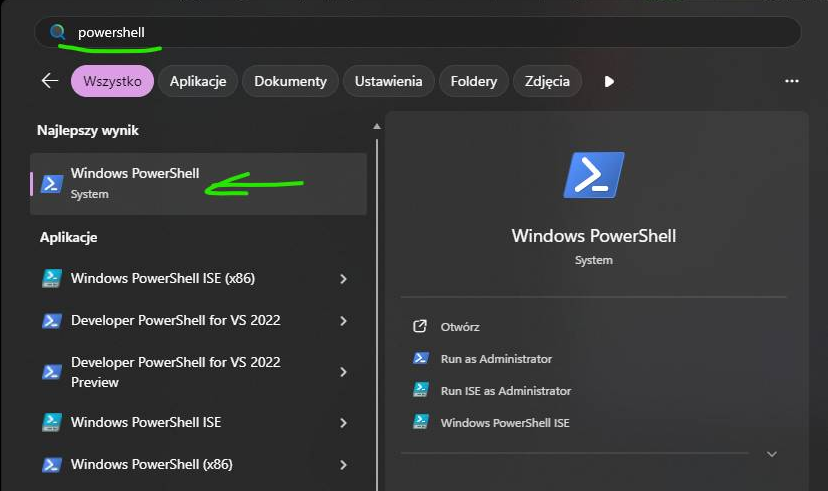

# Moltbook GUI Client

## 🚀 Step-by-step installation in PowerShell

### ✅ One-script installation (Windows)

If you don’t want to manually type commands, you can use the ready-made `setup-moltbook.ps1` script, which automatically:

- checks Python availability,
- creates (or reuses) the `venv` virtual environment,
- installs dependencies from `requirements.txt`,
- launches `main.py`.

### Run the commands in the PowerShell terminal  


#### Step 1 – download project

```powershell
git clone https://github.com/hattimon/moltbook-gui-client.git
cd moltbook-gui-client
```

Make sure the `setup-moltbook.ps1` file exists in the project directory.

#### Step 2 – run script

```powershell
cd "$env:USERPROFILE\moltbook-gui-client"
.\setup-moltbook.ps1
```

If you see `running scripts is disabled`, set execution policy:

```powershell
Set-ExecutionPolicy -Scope CurrentUser -ExecutionPolicy Bypass
.\setup-moltbook.ps1
```


After installation, copy `.env` by the comment

```powershell
copy .env.example .env   # Windows
```

#### What does the script do?

- Checks whether Python is available in `PATH`.
- Creates the `venv` virtual environment if it doesn’t exist.
- Installs packages from `requirements.txt`.
- Launches Moltbook GUI Client.

#### After the first run, subsequent executions will directly start the app.  
#### For example, you can right-click on the file `setup-moltbook.ps1` and select **Run with PowerShell**.  


#### Uninstallation  
Run this command in PowerShell — it will remove the project directory along with the keys.

```powershell
cd "$env:USERPROFILE"
Remove-Item -Recurse -Force ".\moltbook-gui-client"
