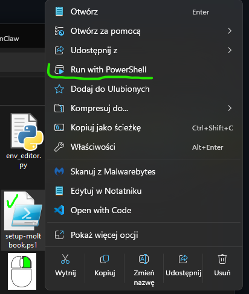

# Moltbook GUI Client

## 🚀 Instalacja krok po kroku w PowerShell

### ✅ Instalacja jednym skryptem (Windows)

Jeśli nie chcesz ręcznie wpisywać komend, możesz użyć gotowego skryptu `setup-moltbook.ps1`, który automatycznie:

- sprawdzi dostępność Pythona,
- utworzy (lub użyje istniejącego) środowiska wirtualnego `venv`,
- zainstaluje zależności z `requirements.txt`,
- uruchomi aplikację `main.py`.

#### Krok 1 – pobranie projektu

```powershell
git clone https://github.com/hattimon/moltbook-gui-client.git
cd moltbook-gui-client
```

Upewnij się, że w katalogu projektu znajduje się plik `setup-moltbook.ps1`.

#### Krok 2 – uruchomienie skryptu

```powershell
cd "$env:USERPROFILE\moltbook-gui-client"
.\setup-moltbook.ps1
```

Jeśli zobaczysz komunikat o zablokowanych skryptach (`running scripts is disabled`), ustaw politykę:

```powershell
Set-ExecutionPolicy -Scope CurrentUser -ExecutionPolicy Bypass
.\setup-moltbook.ps1
```

Po instalacji skopiuj `.env` poleceniem

```powershell
copy .env.example .env   # Windows
```

#### Co robi skrypt?

- Sprawdza, czy Python jest dostępny w `PATH`.
- Tworzy katalog `venv` i środowisko wirtualne (jeśli jeszcze nie istnieje).
- Instaluje pakiety z `requirements.txt` wewnątrz `venv`.
- Uruchamia Moltbook GUI Client.

#### Po pierwszym uruchomieniu kolejne wywołania tylko uruchomią aplikację,  
#### np. klikając prawy przycisk myszy na pliku "setup-moltbook.ps1" i wybierając "Run with PowerShell".   

